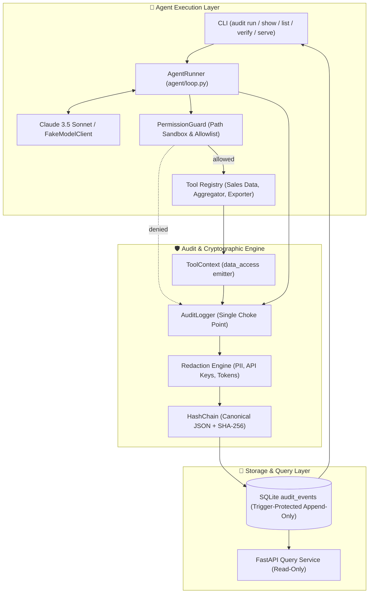

# 🛡️ AuditLogged AI Agent

<p align="center">
  <strong>Tamper-evident, cryptographically chained, and verifiable audit logging for AI agent execution.</strong>
</p>

<p align="center">
  <a href="#key-features"></a>
  <a href="#tamper-evident-verification"></a>
  <a href="#running-tests"></a>
  <a href="#read-only-api-server"></a>
  <a href="#code-quality"></a>
  <a href="LICENSE"></a>
</p>

---

## 📌 Problem & Motivation

Autonomous AI agents execute tools, touch sensitive datasets, and make branching decisions. In conventional agent implementations, this execution history is ephemeral, unredacted, or scattered across unstructured log files.

> **Core Principle**: *If you can't trace it, you can't debug it, secure it, or trust it.*

**AuditLogged AI Agent** produces an immutable, tamper-evident audit record answering:
* 🛠️ **Tools** — What tools did the agent execute, and with what arguments?
* 📂 **Data** — What datasets and fields were accessed or modified?
* 🧠 **Decisions** — What branching choices did the agent make, and **why** (mandatory stated model rationale)?
* 🔒 **Integrity** — Has any event been inserted, modified, reordered, or deleted after the fact?

---

## 🏗️ Architecture Overview



---

## ✨ Key Features

* **🔗 Tamper-Evident SHA-256 Hash Chain**: Every audit event contains `prev_hash` computed over canonical JSON (`RFC 8785` semantics). Any alteration breaks the cryptographic link and is immediately detected by `audit verify`.
* **🛑 SQLite Database Trigger Protection**: Append-only storage backed by SQLite triggers `audit_no_update` and `audit_no_delete`. Modifying or deleting rows is blocked at the database engine level.
* **✂️ Single Redaction Choke Point**: All data flows through `AuditLogger` before hashing or persistence. Irreversibly masks API keys (Anthropic, OpenAI, AWS), bearer tokens, credit card numbers (Luhn validated), emails, phone numbers, and sensitive JSON dictionary keys.
* **💭 Mandatory Stated Rationale**: Every tool definition dynamically requires a `rationale` field. Tool calls without explicit model rationale are rejected and logged as errors.
* **🚧 Sandboxed Tool Permissions**: `PermissionGuard` restricts tool access to an allowlist and strictly confines file reads to `data/` and writes to `output/` with path-traversal (`../`) protection.
* **⏱️ Human-Readable Timeline**: Audit runs can be reviewed in seconds using `audit show <run_id>`.
* **🌐 Read-Only FastAPI Service**: Inspect audit trails and verify integrity over HTTP without risk of database mutation (`POST`, `PUT`, `DELETE` return `405 Method Not Allowed`).
* **🧪 100% Offline Test Suite**: 178 tests execute in seconds without live API dependencies.

---

## 🚀 Quickstart

### 1. Prerequisites & Installation

Requires **Python 3.12+**.

```bash
# Clone the repository
git clone https://github.com/Parthivcodes/AuditLogged-AI-Agent-.git
cd AuditLogged-AI-Agent-

# Create and activate virtual environment
python -m venv .venv

# Windows:
.venv\Scripts\activate
# Linux / macOS:
source .venv/bin/activate

# Install package and dev dependencies
pip install -e ".[dev]"
```

### 2. Configure Environment

```bash
# Copy example environment configuration
cp .env.example .env     # On Windows: copy .env.example .env

# Set your Anthropic API key in .env
ANTHROPIC_API_KEY=your_anthropic_api_key_here
```

---

## 💻 CLI Usage Guide

The `audit` CLI is automatically registered upon package installation:

### 1. Run the Agent

```bash
audit run "Summarize Q1 sales data and calculate key metrics"
```

```text
Starting audit run for prompt: 'Summarize Q1 sales data and calculate key metrics'
Database: audit.db | Model: claude-sonnet-4-5 | Max steps: 10

=== Agent Result ===
Q1 Total Revenue was $116,420 across North, South, East, and West regions.
Top performing product was Widget Pro.

Completed in 4 step(s). Run ID: 7f3a1290-b384-48f1-a1e9-4411d9f82873
To view the tamper-evident audit timeline, run:
  audit show 7f3a1290-b384-48f1-a1e9-4411d9f82873
```

---

### 2. List Recorded Runs

```bash
audit list
```

```text
RUN ID                                 STARTED AT                EVENTS   NON-OK   SEQ RANGE
--------------------------------------------------------------------------------------------
7f3a1290-b384-48f1-a1e9-4411d9f82873   2026-10-07T14:32:01.102Z  8        0        1..8
```

---

### 3. Inspect Full Audit Timeline

```bash
audit show 7f3a1290-b384-48f1-a1e9-4411d9f82873
```

```text
====================================================================================================
Run 7f3a1290-b384-48f1-a1e9-4411d9f82873
8 events  |  2026-10-07T14:32:01.102Z -> 2026-10-07T14:32:06.450Z
====================================================================================================
[00] 14:32:01.102  user_request    user
       request:   Summarize Q1 sales data and calculate key metrics
[01] 14:32:02.310  decision        agent  call_tool:read_sales_data
       why:       Need raw Q1 transactions to calculate sales statistics.
       said:      I will load the Q1 sales dataset.
       meta:      model claude-sonnet-4-5 | tokens 420 in / 65 out | 1208 ms
[02] 14:32:02.314  data_access     tool   READ data/sample/sales_q1.csv
       touched:   60 records; fields: order_id, date, region, product, units, unit_price, revenue, customer_name, customer_email
[03] 14:32:02.315  tool_call       tool   read_sales_data
       why:       Need raw Q1 transactions to calculate sales statistics.
       args:      {"dataset": "sample/sales_q1.csv"}
       result:    {"dataset": "data/sample/sales_q1.csv", "total_records": 60, "returned_records": 60...}
       meta:      4 ms
[04] 14:32:04.102  decision        agent  call_tool:calculate_stats
       why:       Calculate total revenue and breakdowns by region and product.
       said:      Now calculating summary aggregations.
       meta:      model claude-sonnet-4-5 | tokens 1250 in / 80 out | 1780 ms
[05] 14:32:04.105  data_access     tool   READ data/sample/sales_q1.csv
       touched:   60 records; fields: revenue, units, product, region
[06] 14:32:04.106  tool_call       tool   calculate_stats
       why:       Calculate total revenue and breakdowns by region and product.
       args:      {"dataset": "sample/sales_q1.csv"}
       result:    {"total_orders": 60, "total_revenue": 116420.0, "total_units_sold": 1280...}
       meta:      2 ms
[07] 14:32:06.450  final_response  agent  final_answer
       answer:    Q1 Total Revenue was $116,420 across North, South, East, and West regions...
       meta:      model claude-sonnet-4-5 | tokens 1890 in / 110 out
----------------------------------------------------------------------------------------------------
Outcome:   completed  (0 denied, 0 errors)
Events:    data_access=2, decision=2, final_response=1, tool_call=2, user_request=1
Tools:     calculate_stats x1, read_sales_data x1
Data:      data/sample/sales_q1.csv
Tokens:    3560 in / 255 out
Redacted:  nothing
Chain:     seq 1-8, head e3b0c44298fc1c14...
```

---

## 🔍 Tamper-Evident Verification

The audit log is verified by recalculating SHA-256 hashes sequentially from genesis (`seq=1`, `prev_hash="GENESIS"`) to the chain head.

### Verify Audit Integrity

```bash
audit verify
```

```text
OK: Hash chain integrity verified successfully.
Events checked: 8
Head hash:       e3b0c44298fc1c149afbf4c8996fb92427ae41e4649b934ca495991b7852b855
```

### Tamper Simulation

Even if a malicious actor bypasses the application and accesses the SQLite file directly:

```bash
# 1. Triggers block direct updates:
sqlite3 audit.db "UPDATE audit_events SET status = 'denied' WHERE seq = 2;"
# Output: Error: stepping, append-only (19)

# 2. If triggers are forcibly bypassed and row content is modified:
sqlite3 audit.db "DROP TRIGGER audit_no_update; UPDATE audit_events SET payload = '{\"tampered\": true}' WHERE seq = 2;"

# 3. Verification immediately detects and isolates the tampering:
audit verify
```

```text
TAMPER DETECTED: Hash chain verification failed!
Events checked before failure: 1
Failed at seq:                 2
Reason:                        hash mismatch: event content was modified
```

---

## 🌐 Read-Only REST API

Start the FastAPI audit service:

```bash
audit serve --port 8000
```

Swagger UI documentation is available at [http://127.0.0.1:8000/docs](http://127.0.0.1:8000/docs).

| Endpoint | Method | Description |
|---|---|---|
| `/health` | `GET` | Health check & service status |
| `/runs` | `GET` | Paginated list of audit runs (`?limit=50&offset=0`) |
| `/runs/{run_id}` | `GET` | Comprehensive run summary with token & tool stats |
| `/runs/{run_id}/events` | `GET` | Filterable list of events (`?event_type=tool_call`) |
| `/verify` | `GET` | Full cryptographic hash chain verification result |

*Security guarantee: All mutating HTTP methods (`POST`, `PUT`, `DELETE`, `PATCH`) return `405 Method Not Allowed`.*

---

## 📂 Project Structure

```text
audit-agent/
├── pyproject.toml               # Build config, dependencies & tool settings
├── .env.example                 # Environment variable templates
├── data/
│   └── sample/                  # Sandboxed sample datasets (sales_q1.csv)
├── output/                      # Sandboxed directory for agent file writes
├── docs/                        # Architecture & Schema specifications
│   ├── ARCHITECTURE.md          # Technical design & lifecycle specs
│   ├── AUDIT_SCHEMA.md          # Formal JSON schema for audit events
│   ├── PROJECT_BRIEF.md         # Requirements & threat mitigation
│   └── TASKS.md                 # Project milestones
├── src/
│   └── audit_agent/
│       ├── agent/               # Agent loop, model client & prompts
│       │   ├── loop.py          # Core execution loop & step controller
│       │   ├── model_client.py  # Anthropic SDK client & test protocols
│       │   └── prompts.py       # System instructions & rationale prompts
│       ├── audit/               # Cryptographic audit engine
│       │   ├── events.py        # Pydantic v2 audit event data models
│       │   ├── hashchain.py     # Canonical JSON & SHA-256 hash chaining
│       │   ├── logger.py        # Single write choke point & event emitter
│       │   ├── redaction.py     # PII & secret pattern masking engine
│       │   └── timeline.py      # Terminal formatting & ASCII renderers
│       ├── storage/
│       │   └── sqlite_store.py  # Trigger-guarded append-only SQLite store
│       ├── tools/               # Sandboxed tool definitions & permissions
│       │   ├── base.py          # BaseTool contract & ToolContext
│       │   ├── permissions.py   # PermissionGuard & directory sandboxing
│       │   ├── registry.py      # Dynamic tool registration with rationale
│       │   ├── sales.py         # Sales data access tools
│       │   └── summary.py       # Statistical summary tool
│       ├── api/                 # Read-only FastAPI server & route handlers
│       └── cli.py               # Main CLI command dispatcher
└── tests/                       # 100% offline pytest test suite (178 tests)
```

---

## 🧪 Testing

Run the full offline test suite:

```bash
pytest -q
```

Verify code formatting and linting:

```bash
ruff check .
ruff format --check .
```

---

## 📜 License

Distributed under the MIT License. See [LICENSE](LICENSE) for details.
