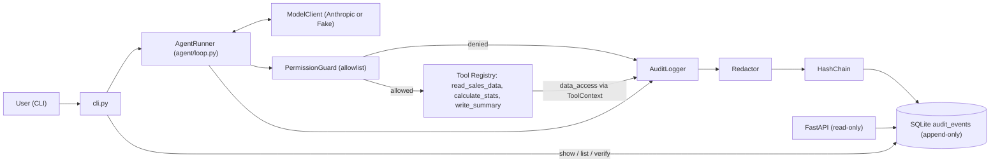

# Architecture

## Components

| Component | Responsibility |
|---|---|
| `cli.py` | Entry point: `audit run | show | list | verify | serve` |
| `agent/loop.py` (`AgentRunner`) | Drives model ↔ tool loop, emits audit events, enforces max steps |
| `agent/model_client.py` | `ModelClient` protocol; `AnthropicModelClient` implementation; fakes in tests |
| `tools/permissions.py` (`PermissionGuard`) | Allowlist + path sandbox (`data/` read, `output/` write) |
| `tools/registry.py` | Registered tools and their Anthropic schemas (with injected `rationale`) |
| `audit/logger.py` (`AuditLogger`) | Single write choke point: build → redact → chain → store |
| `audit/redaction.py` | Masks secrets/PII as `[REDACTED:<type>]`, records tags |
| `audit/hashchain.py` | Canonical JSON, SHA-256 hashing, chain verification |
| `storage/sqlite_store.py` | Append-only SQLite table guarded by triggers; read queries |
| `api/` | Read-only FastAPI query endpoints |

## Run Lifecycle
1. CLI creates a `run_id` and logs `user_request`.
2. Loop (≤ `AUDIT_MAX_STEPS`): call the model with tool schemas; record token usage.
3. For each `tool_use` block:
   - Log `decision` (`call_tool:<name>`) with `rationale` (from tool input) and
     `model_explanation` (visible assistant text).
   - Missing/empty `rationale` → log `error`, do not execute, return `is_error` to model.
   - `PermissionGuard` check → if denied, log `tool_call` with `status=denied`,
     return `is_error` to model.
   - If allowed, execute with a `ToolContext`; tool emits `data_access` events
     (source, operation, records, fields); then log `tool_call` (redacted args,
     redacted result preview ≤ 500 chars, latency, status).
4. On `stop_reason == "end_turn"`, log `final_response` (text, tokens).
5. Any exception → `error`. Every run ends with `final_response` or `error`.

## Resolved Design Decisions
- **Hash chain scope:** one global chain across all runs (detects deletion of whole runs).
- **Redaction:** irreversible masks `[REDACTED:<type>]`, all in `audit/redaction.py` so
  a salted-hash token strategy can be added later without touching callers.
- **Tool output logging:** redacted, truncated previews only (≤ 500 chars).
- **Concurrency:** single writer; appends in `BEGIN IMMEDIATE` transactions.
- **Reasoning:** stated rationale + visible text only; extended thinking disabled.

## Tech Choices

| Choice | Justification |
|---|---|
| Python 3.12 | Modern typing; stable support in Anthropic SDK and FastAPI. |
| `anthropic` SDK | Native tool use with JSON schemas and per-response token usage. |
| Model via `AUDIT_AGENT_MODEL` | Swap models without code changes; model recorded per event. |
| pydantic v2 | Typed, validated event models; already a FastAPI dependency. |
| SQLite (`sqlite3`) | Zero-ops single file; triggers enforce append-only. |
| SHA-256 hash chain (`hashlib`) | Simple, well-understood tamper evidence; linear verification. |
| stdlib `csv` + `statistics` | Demo data is small; no pandas needed. |
| argparse | Stdlib CLI, no extra dependency. |
| FastAPI + uvicorn | Typed, self-documenting read-only API and its ASGI server. |
| pytest + httpx | Fixtures for temp DBs/fake clients; httpx for FastAPI TestClient. |
| ruff | One fast tool for lint + format. |
| setuptools, pip + venv | Standard packaging, nothing extra to install. |

## Known Limitations
- Replacing the entire DB file defeats the chain; future work: export/sign the chain head.
- Deleting the most recent events (tail truncation) leaves a valid shorter chain; the same
  chain-head export/signing is the fix. Mid-chain edits/deletes/inserts are always detected.
- Redaction is pattern-based and can miss novel formats; tests seed known PII.
